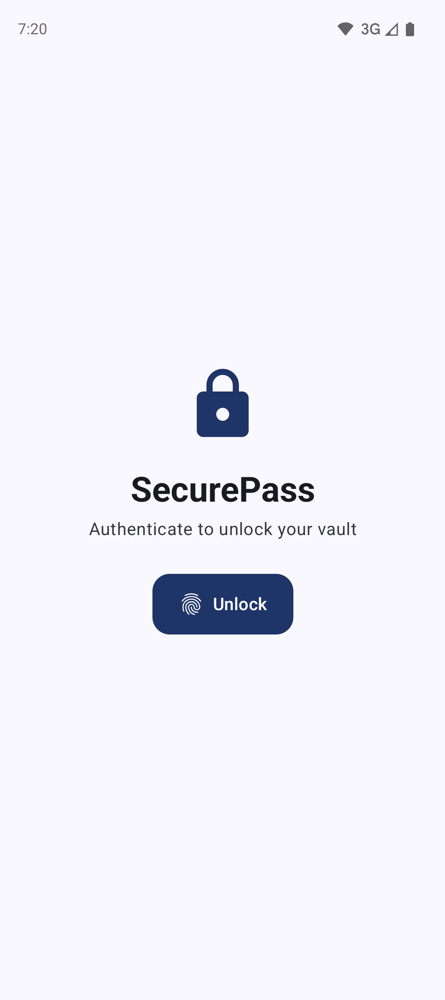
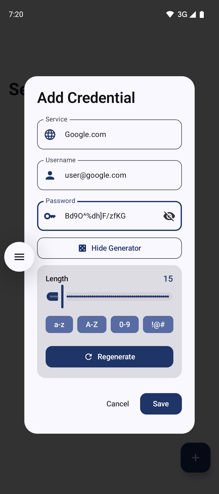

# SecurePass 🛡️

SecurePass es un gestor de contraseñas de alta seguridad para Android, diseñado bajo el paradigma de **Privacidad por Diseño**. La aplicación es 100% offline y utiliza estándares militares de cifrado para garantizar que las credenciales nunca salgan del dispositivo.

## Características Principales
- **Cifrado AES-256 GCM:** Implementación robusta mediante la librería `androidx.security:security-crypto`.
- **Autenticación Biométrica:** Acceso seguro integrado con `BiometricPrompt`.
- **Zero-Internet:** La aplicación no solicita el permiso de `INTERNET`, eliminando cualquier vector de filtración de datos.
- **Material 3 & Dynamic Color:** Interfaz moderna con soporte para iconos temáticos (Monochrome) y modo oscuro.
- **Clean Architecture:** Separación clara de capas (Domain, Data, Presentation).

## Tech Stack
- **UI:** Jetpack Compose con Material Design 3.
- **DI:** Hilt (Dagger) para inyección de dependencias.
- **Database:** Room Persistence con cifrado de datos.
- **Async:** Kotlin Coroutines & Flow para manejo de flujos reactivos.
- **Processing:** KSP (Kotlin Symbol Processing) para una compilación eficiente.
- **Architecture:** MVVM (Model-View-ViewModel).

## Arquitectura
El proyecto sigue los principios de **Clean Architecture** y **SOLID**:
- **Domain:** Contiene las entidades de negocio, repositorios (interfaces) y casos de uso (Use Cases). Es una capa puramente Kotlin, libre de dependencias de Android.
- **Data:** Implementación de repositorios, DAOs de Room, entidades de base de datos y la lógica de cifrado.
- **Presentation:** ViewModels y Composable functions encargados de la lógica de UI.

## Seguridad (Security Disclosure)
Este proyecto utiliza el **Android Keystore System** para generar y almacenar claves criptográficas de forma segura. Las contraseñas se almacenan como `ByteArray` cifrados, nunca como texto plano en memoria o disco.

## Screenshots
| Pantalla Principal | Acceso Biométrico | Agregar Contraseña |
| :---: | :---: | :---: |
|  |  |  |